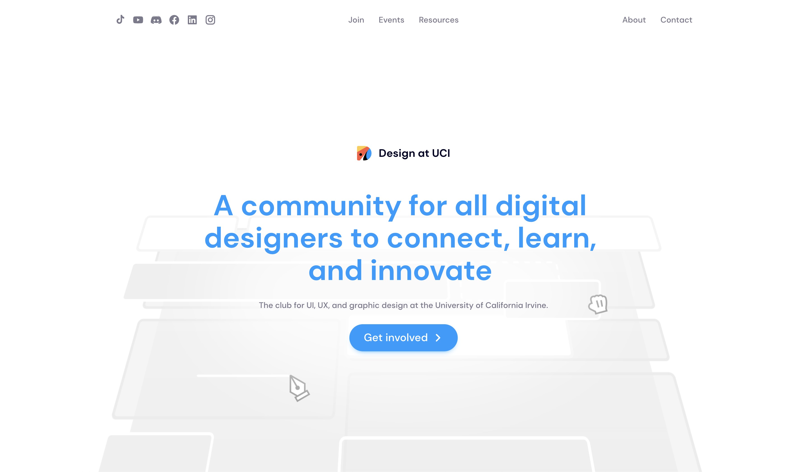

# Design @ UCI main site



## Running the app

This app is built on CRA without any custom webpack configs and utilizes the default react scripts. To run the app, first download the source code from the github and install all the dependencies. If you're using a unix based terminal, you can run the following commands (assuming you already have node/npm installed):

```bash
$ pwd
/path/to/place/you/want/to/put/the/code

$ git clone https://github.com/designatuci/DUCI-website.git
Cloning into 'DUCI-website'...
...other install messages

$ ls
DUCI-website
...other files in this directory

$ cd CUCI-website

$ npm install
```

To run a development server, you can use the default npm start command:

```bash
$ npm start
```

and you can open up your app on [http://localhost:3000](http://localhost:3000) (or another port if you know what you're doing).

## Understanding the file structure

```bash
DUCI-website
├── assets (images for this README)
│   └── ...
├── public
│   ├── static
│   │   └── ...various assets
│   └── index.html
├── src
│   ├── app (<- all app code here. see #architecture)
│   └── assets
│       └── data
│           ├── alumniBoard.json
│           ├── currentBoard.json
│           ├── merchList.json
│           ├── resources.json
│           └── socials.json
├── .gitignore
├── package.json
└── README.md
```

#### Basic list of important files and what they do

| Files              | Description                                                     | Used in                                                                        |
| ------------------ | --------------------------------------------------------------- | ------------------------------------------------------------------------------ |
| alumniBoard.json   | information of all alumni board members                         | `src/app/pages/About`                                                          |
| currentBoard.json  | information of all current board members                        | `src/app/pages/About`                                                          |
| merchList.json     | list of all historical merch data (currently only has stickers) | `src/app/pages/Merch`                                                          |
| resources.json     | all design resources for club members                           | `src/app/pages/Resources`, `src/app/pages/ResourcesFeatured`                   |
| socials.json       | social media links for DUCI                                     | `src/app/pages/Contact`, `src/app/components/Nav`, `src/app/components/Footer` |
| short_socials.json | full social media icon-links for DUCI                           | `src/app/pages/Join`, `src/app/pages/Hey`                                      |

#### Architecture

Similar to Gatsby and Next.js, all page components are stored in the `app/pages` folder. The original name for this folder was `routes` but with react-router-dom v6 changing the name of `<Switch />` to `<Routes/>`, this change was made.

All individual components that are not pages belong in the `app/components` folder and pure JS logic / React hooks are in the `app/controllers` folder. The exception for this are components that are used exclusively within a certain page. In these cases, the page itself will have its own set of `controllers` and `components` folders.

React is designed with a top-down unidirectional data flow. When deciding where to place state, for example, the general rule of thumb is to place it as low level as possible. We follow this type practice with the file structure as well where we place the React components as low level as possible.

Example of a nested structure using this practice:

```bash
└── pages
    ├── ..other pages
    └── LiveMap
        ├── components
        │   └── Map
        │       ├── components
        │       │   ├── CenterMapButton
        │       │   └── ZoomControls
        │       ├── Map.js
        │       └── index.js
        ├── LiveMap.js
        └── index.js
```

In this example, the LiveMap page contains a Map component. The Map components itself, however, is a complicated component and has its own set of components like ZoomControls and CenterMapButton that are only useful to the Map and so the component files are nested.

#### File structure for component/page itself

Usually every component, if large enough to warrant a folder, will contain the component source code (with the same name as the directory its in) and an `index.js` that exports it by default.

It can have a `/components`, `/controllers`, or `/assets` folder. It will usually also have a styles file using sass modules.

An example of a fleshed out component can look like this:

```bash
└── ZoomControls
    ├── assets
    ├── components
    ├── controllers
    ├── ZoomControls.js
    ├── ZoomControls.module.scss
    └── index.js
```

`/assets` should contain images and other (potentially data) assets that are used by the component like icons that supplement the component. However, if it is a config file that is subject to change, it should be placed in the master assets folder at the top level or make a request to the server resource with the location stored in a .env file.

An example is the list of board members that gets displayed in the `About` page. This list is expected to change from time to time and potentially be updated by people who are not React developers. That's why these assets should not be nested deep in the project directory and be bundled together with the rest of config data.

### Suspense

Currently, the final build size is about 50kb which isn't nearly big enough to warrant implementing Suspense for every page but probably will have plans to do so since the infrastucture is there.

### Immediate improvements to be made

-   i18n?
-   a11y - mouse hover interaction (fields - text, buttons - pointer), semantic html (text component for example should be switched to various h tags)
-   pagination for events list
-   A lot of styling still needs to be refactored

### Later planned updates:

Would like to rewrite the way designathons are currently structured. Since the designathon is over and the next one isn't for a while, there are no immediate plans to make these changes (especially since it's a fat >3k sloc file) but ideally we have a history of previous designathon websites.

Up to us on whether we want to keep the same format for every year and only change the data or have a new design format like most hackathon websites.
